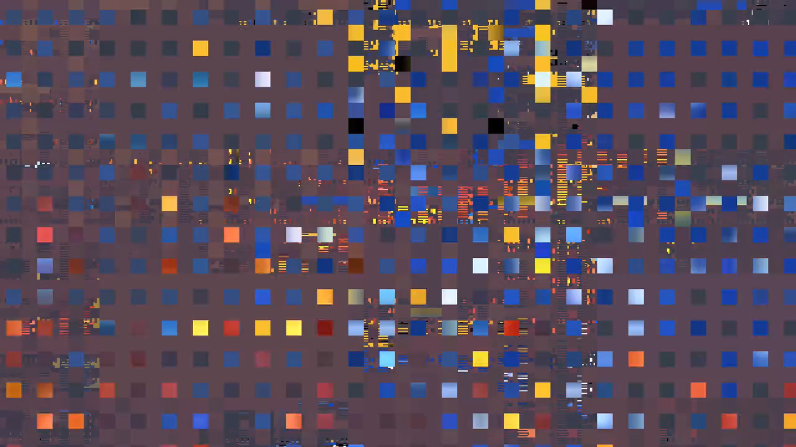
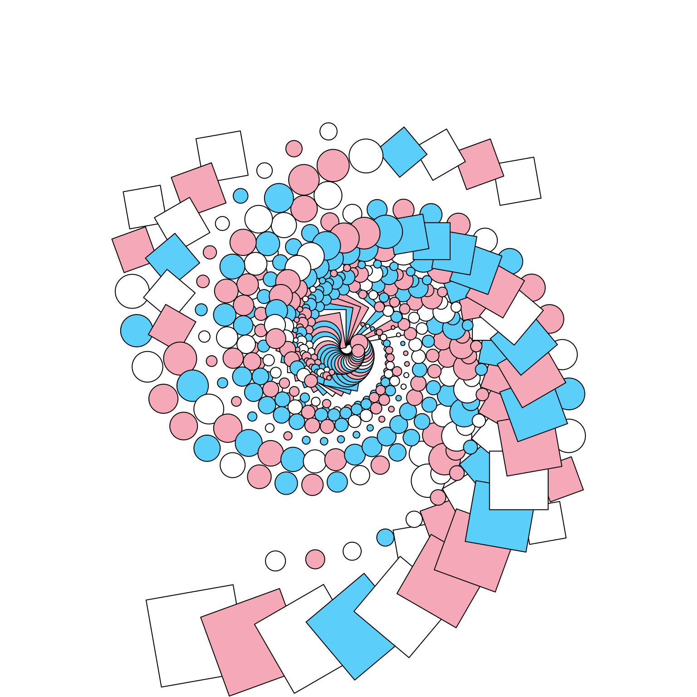

# zixu0859_IDEA9103_WEEK-8
## PART 1 : Imaging Technique Inspiration
### Inspiration sources
- _I chose the “Infinite Command Team” by Casey Reas as my inspiration._

[Original link to this artwork](https://www.seditionart.com/casey_reas/artworks)
 
### Reason
  
- I’d like to incorporate __grid-based generative art__, inspired by Casey Reas, into my project. This technique, which uses structured grids and randomized elements, is beneficial because it offers a balance between order and creativity. It allows for dynamic, evolving visuals while maintaining a clear structure, making it both visually engaging and easy to implement algorithmically. This approach aligns well with the assignment requirements, as it ensures variety in the imagery while keeping the design simple, scalable, and adaptable to different contexts or user interactions.

## PART 2 : Coding Technique Exploration
- A useful coding technique for implementing the __grid-based generative art__ is the use of nested __“loops”__ in p5.js. By looping through __“x”__ and __“y”__ coordinates, I can create grid structures, and within each grid cell, apply random properties like __color, size, or shape__ using functions such as __“random()”__. This method allows for the controlled generation of __dynamic visuals__, ensuring a balance between structured design and randomness. It contributes to the desired effect by automating variation across the grid, creating unique, evolving patterns while maintaining visual coherence through consistent grid alignment. This technique simplifies complexity and offers flexibility.

[Original link to this artwork](https://docs.kogics.net/tutorials/generative-art-grid-intro.html)

[Original link to this artwork](https://blog.djnavarro.net/posts/2023-03-31_generative-art-with-grid/)

